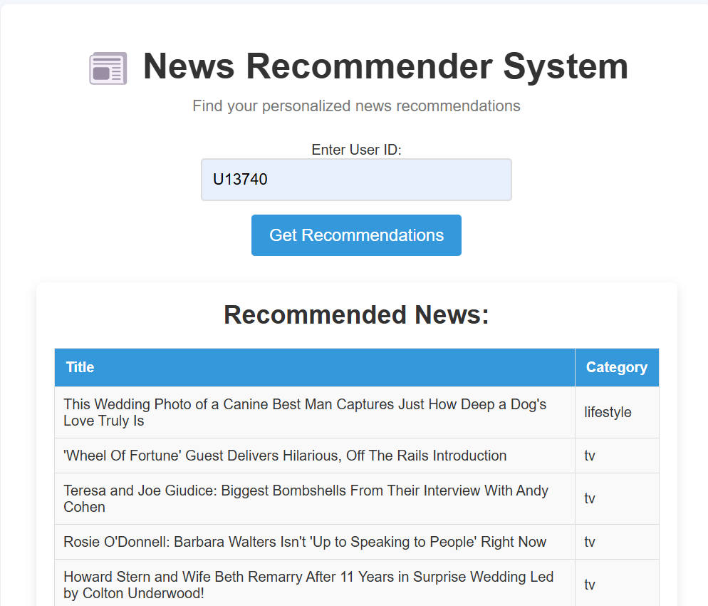

# 📰 NewsPress – Personalized News Recommender System

NewsPress is a BERT-powered news recommender system that suggests personalized articles based on users' reading history. Built on the Microsoft MIND dataset, it combines content-based filtering with deep NLP to deliver relevant, engaging news.

static
/Screenshot 2025-04-27 122637.png
## 🖼️ User Interface Preview



---

## 🚀 Features

- Personalized top-N news recommendations
- Semantic embeddings using BERT (`all-MiniLM-L6-v2`)
- Clicks vs Accuracy scatter plot (Chart.js)
- Category distribution visualization (Pie chart)
- Responsive frontend (HTML/CSS/JS), Flask backend

---

## ⚙️ Tech Stack

- **Frontend:** HTML, CSS, JavaScript, Chart.js  
- **Backend:** Flask, Pandas, Pickle  
- **NLP:** HuggingFace Transformers (MiniLM)  
- **Hosting:** Render  
- **Dataset:** Microsoft MIND (News + Behaviors)

---

## 🧠 How It Works

1. **Load Data:** Parse news content and user behaviors from MIND dataset.  
2. **Embed News:** Use MiniLM to create dense vector embeddings for titles.  
3. **Profile Users:** Average vectors of clicked articles to build user profiles.  
4. **Recommend:** Use cosine similarity to suggest most relevant unseen articles.  
5. **Evaluate:** Plot clicks vs accuracy across users.

---

## 📈 Visualizations

- 📊 Accuracy vs Clicks (scatter)
- 🥧 Recommended Category Distribution (pie)
- 📋 Tabular Recommendations (title + category)

---

## 📁 Setup

```bash
git clone https://github.com/yourusername/NewsPress.git
cd NewsPress
pip install -r requirements.txt
python app.py  # or use gunicorn for production
